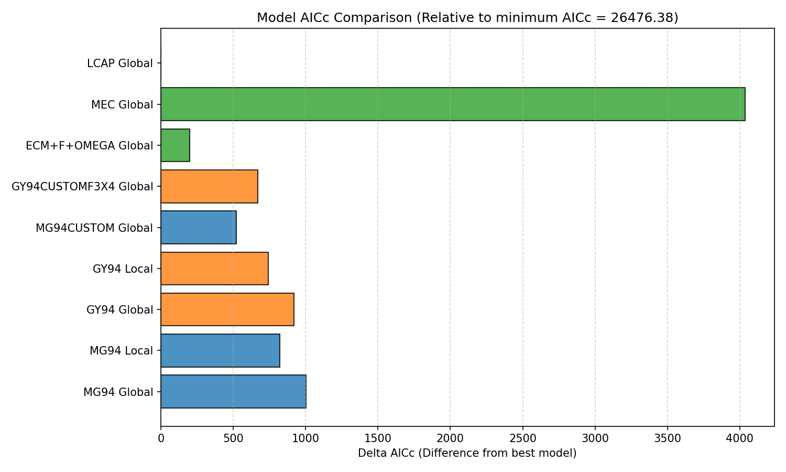
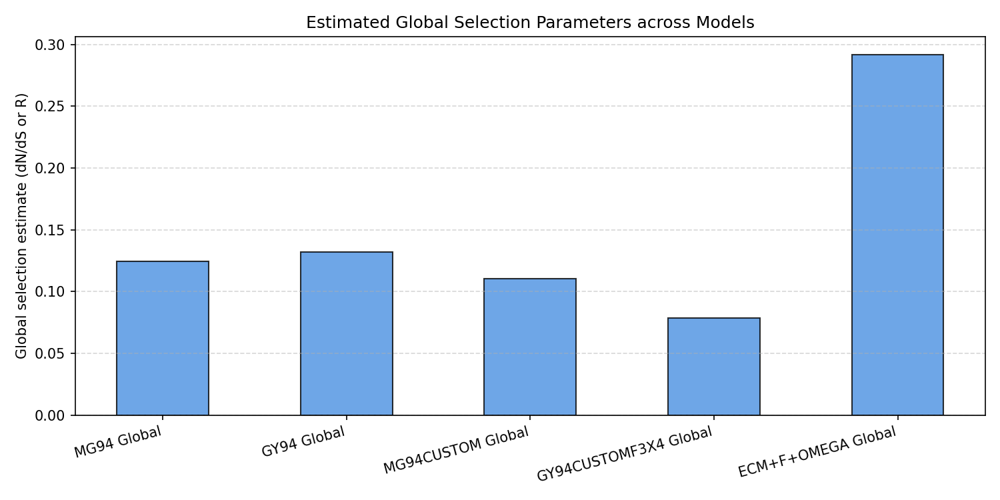
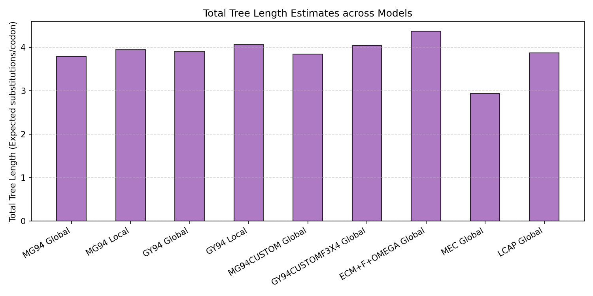

# Codon Substitution Analysis: Yokoyama Rhodopsin Dataset

This report provides an interpretive comparison of nine different codon substitution model configurations fitted to the Yokoyama vertebrate rhodopsin dataset (`tests/data/yokoyama.rh1.cds.mod.1-990.nex`). 

The dataset consists of 36 sequences and 71 branches (990 nucleotides/330 codons in length).

---

## 1. Executive Summary

- **Best Fit Model**: **LCAP Global** (Linear Combination of Amino Acid Properties) provides the best overall fit with an AIC-c of **26476.38**, followed closely by **ECM+F+OMEGA Global** (Empirical Codon Model) with **26676.22**.
- **Mechanistic baseline**: **GY94 Global** (AIC-c = 27397.54) outperforms **MG94 Global** (AIC-c = 27477.45) by ~80 AIC-c units, showing the importance of codon-level frequency scaling for rhodopsin.
- **Custom bias matrix**: Specifying custom GTR-like nucleotide biases (e.g., the HKY85-like `010010` bias in `MG94CUSTOM`) improves the fit dramatically (delta AIC-c = -481.36 compared to baseline MG94).
- **Rate Heterogeneity**: Both `MG94 Local` and `GY94 Local` models show a massive improvement in likelihood over their Global counterparts, demonstrating that selection rates (dN/dS) vary significantly across different lineages in the vertebrate rhodopsin phylogeny.
- **Selection Pressure**: All global selection estimates (ranging from 0.08 to 0.29) indicate that the rhodopsin gene is overall under strong purifying (selective) constraint.

---

## 2. Model Fit Comparison

Below is the summary table of the log-likelihood (logL), parameter count, information criteria (AIC, AIC-c, BIC), estimated tree length, and global selection parameter (R or omega) for each model:

| Model Configuration | Log Likelihood | Parameters | AIC | AIC-c | BIC | Total Tree Length | dN/dS Estimate |
|:---|:---:|:---:|:---:|:---:|:---:|:---:|:---:|
| **LCAP Global** | -13160.71 | 77 | 26475.42 | **26476.38** | 27048.04 | 3.877 | *N/A (Biophysical)* |
| **ECM+F+OMEGA Global** | -13266.70 | 71 | 26675.40 | **26676.22** | 27203.40 | 4.378 | 0.292 |
| **MG94CUSTOM Global** | -13425.62 | 72 | 26995.25 | **26996.09** | 27530.69 | 3.845 | 0.110 |
| **GY94CUSTOMF3X4 Global**| -13500.36 | 72 | 27144.71 | **27145.55** | 27680.15 | 4.050 | 0.079 |
| **GY94 Local** | -13466.36 | 141 | 27214.72 | **27217.95** | 28263.29 | 4.062 | *Variable per branch*|
| **MG94 Local** | -13507.52 | 140 | 27295.05 | **27298.23** | 28336.18 | 3.947 | *Variable per branch*|
| **GY94 Global** | -13626.35 | 72 | 27396.69 | **27397.54** | 27932.13 | 3.902 | 0.132 |
| **MG94 Global** | -13667.31 | 71 | 27476.63 | **27477.45** | 28004.63 | 3.794 | 0.125 |
| **MEC Global** | -15179.54 | 76 | 30511.08 | **30512.02** | 31076.27 | 2.936 | *N/A (WAG empirical)* |

---

## 3. Visualizations

### 3.1 Model Information Criteria Comparison
The delta AIC-c score measures the information loss relative to the best-fitting model. Lower delta AIC-c indicates a better model:

### 3.2 Global Selection Pressure Estimates
Comparison of the estimated global selection parameters (dN/dS or R) across the global models:

### 3.3 Total Tree Length Estimates
Comparison of the total estimated tree lengths (expected substitutions per codon):

---

## 4. Key Interpretations & Discussions

### 4.1 Why LCAP and ECM Fit Best
1. **LCAP (Linear Combination of Amino Acid Properties)**:
   This model achieves the highest likelihood and lowest AIC-c because it does not assume all non-synonymous changes are penalised equally. Instead, it scales rates according to differences in five biophysical properties (Chemical Composition, Polarity, Volume, Isoelectric Point, and Hydropathy). Since rhodopsin is a membrane-bound G-protein coupled receptor (GPCR) with highly conserved hydrophobic transmembrane helices, substitutions that alter polarity or volume are heavily selected against, while chemically similar substitutions are tolerated. LCAP captures these biophysical constraints directly by estimating property-specific weights.
2. **ECM (Empirical Codon Model)**:
   The empirical transition matrix accounts for realistic substitution patterns derived from a large database of actual alignments. It captures complex multi-nucleotide changes (e.g., double and triple mutations occurring in the same codon), which mechanistic models (MG94/GY94) assume are impossible (rate = 0).

### 4.2 Global vs. Local Models
Fitting branch-specific selection parameters (`Local` models) improves the log-likelihood by **159.8 units** for MG94 and **160.0 units** for GY94. Even though local estimation adds 69 new parameters to the model, the AIC-c decreases significantly:
- MG94 Global (27477.45) -> MG94 Local (27298.23)
- GY94 Global (27397.54) -> GY94 Local (27217.95)

This nested LRT comparison strongly rejects the null hypothesis of a uniform global selection pressure across the tree (p < 0.0001), indicating that different lineages of vertebrate rhodopsin have evolved under varying levels of selective constraint (e.g., changes in selective pressures between terrestrial and deep-sea fish lineages).

### 4.3 dN/dS Estimates Divergence
The dN/dS values estimated under global models differ:
- **GY94 Global** estimates omega = 0.132, whereas **MG94 Global** estimates R = 0.125.
- **ECM+F+OMEGA** estimates a higher omega of 0.292. This occurs because the baseline empirical matrix already accounts for amino acid similarity; hence, the additional selection parameter omega represents selection above and beyond the baseline empirical constraints, rather than a raw ratio of synonymous vs. non-synonymous rates.

### 4.4 Tree Length Variations
The total tree length (sum of branch lengths) represents the total expected substitutions per codon:
- Empirical models like **ECM+F+OMEGA** estimate the longest tree (4.38), because they account for double/triple substitutions.
- **MEC Global** estimates a much shorter tree (2.94) because it restricts substitution patterns to WAG empirical rates.
- Standard mechanistic models are highly consistent, estimating a tree length of ~3.8 to 4.0 expected substitutions per site.
