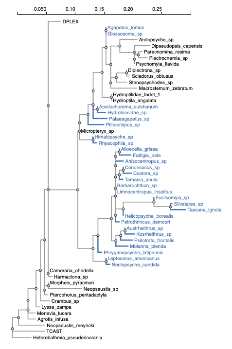
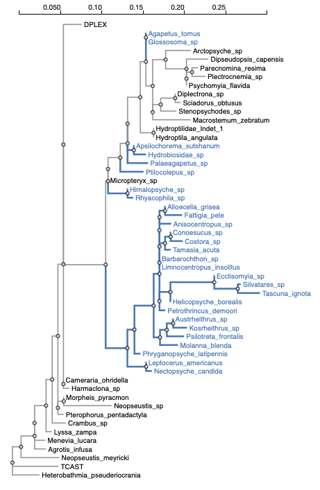
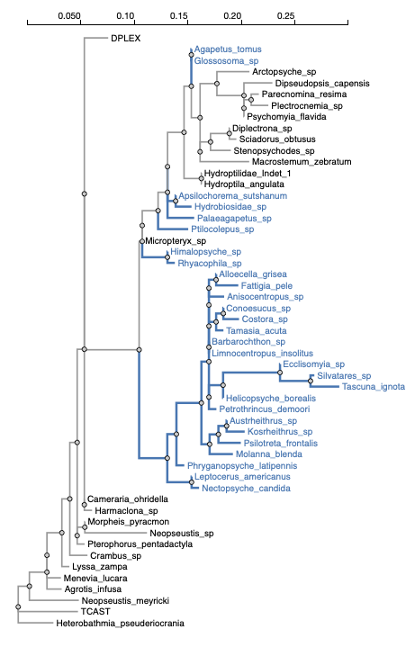
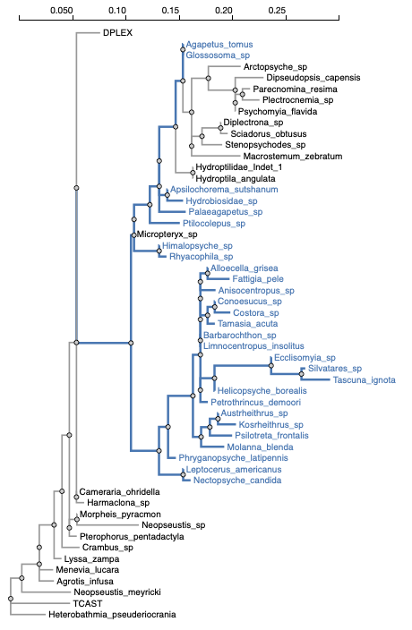
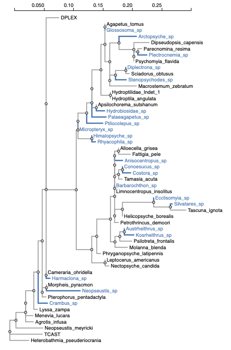
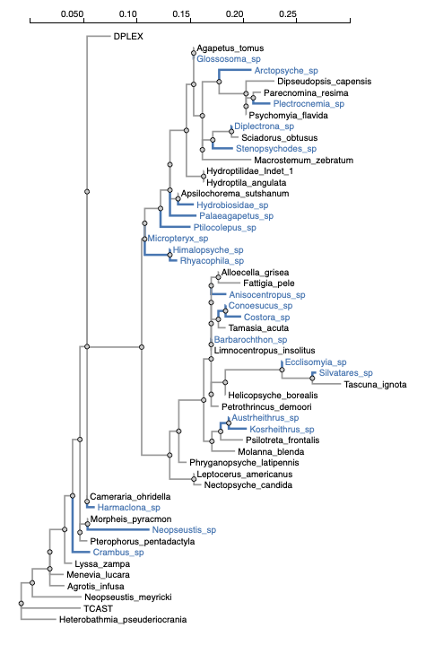

## LabelTrees -- automatic tree annotation for partitioned analyses

Given an input Newick tree, and either a regular expression **or** a list of taxon names in a file, the script annotates the tree

## Invokation

This analysis has two **required** arguments

- `--tree` the file containing the Newick-format tree to annotate
- `--output` the file where the labelled tree will be written


### Complete options list


```
Available analysis command line options
---------------------------------------
Use --option VALUE syntax to invoke
If a [reqired] option is not provided on the command line, the analysis will prompt for its value
[conditionally required] options may or not be required based on the values of other options

tree [required]
	The tree to annotate (Newick format)

regexp
	Use the following regular expression to select a subset of leaves
	default value: ()

label
	Use the following label for annotation
	default value: Foreground

list [required]
	Line list of sequences to include in the set (required if --regexp is not supplied)

internal-nodes
	Strategy for labeling internal nodes
	default value: All descendants

output [required]
	Write labeled Newick tree to
```


## Example runs


Results can be viewed using [Phylotree.js](phylotree.hyphy.org)

1. Label only the sequences specified in the line list file.

```
hyphy label-tree.bf --tree data/unlabeled.nwk  --list data/list.txt --output only.nwk --internal-nodes None
```



2. Label the sequences specified **and** internal nodes with **all** descendants that are labeled (default)

```
hyphy label-tree.bf --tree data/unlabeled.nwk  --list data/list.txt --output all.nwk
```



3. Label the sequences specified **and** some internal nodes using parsimony

```
hyphy label-tree.bf --tree data/unlabeled.nwk  --list data/list.txt --output parsimony.nwk --internal-nodes "Parsimony"
```



4. Label the sequences specified **and**  internal nodes with **some** descendants that are labeled

```
hyphy label-tree.bf --tree data/unlabeled.nwk  --list data/list.txt --output some.nwk --internal-nodes "Some descendants"
```



5. Label using a regular expression (here, anything that ends in `sp`)

```
hyphy label-tree.bf --tree data/unlabeled.nwk  --regexp 'sp$' --output regexp-none.nwk --internal-nodes "None"
```



6. Label using a regular expression (here, anything that ends in `sp`) and parsimony

```
hyphy label-tree.bf --tree data/unlabeled.nwk  --regexp 'sp$' --output regexp.nwk --internal-nodes "Parsimony"
```


